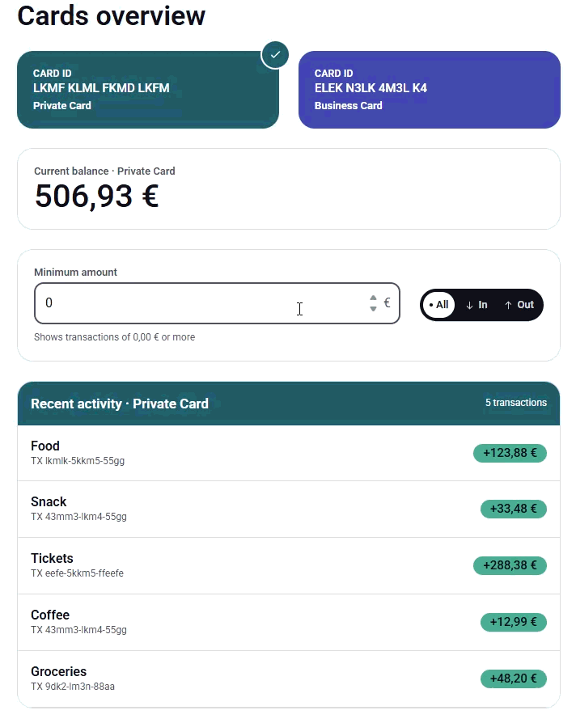

# Cards & Transactions

A banking-style overview page: card selection, balance, filters, transaction list.



## How to run

```bash
yarn
yarn dev      # start the dev server
yarn test run # run the full test suite once
yarn build    # typecheck + production build
yarn lint     # eslint
```

## Assumptions & tradeoffs

**Data**
- *Adapter over direct JSON imports*: one normalizing layer (`src/adapters/`)
  hides source-data inconsistencies behind a stable `Card`/`Transaction`
  contract, so swapping in a real API later needs no architecture change.
- *Three-way amount classification* (`settled` / `pending` / `invalid`):
  `null` is a real business state, not missing data, and can't be confused
  with unparseable data. Collapsing either into `0` would misrepresent
  real money.
- *Duplicate transaction ids kept, not removed*: dropping one would
  silently discard real money movement. React's `key` uses a synthetic
  `${id}-${index}` instead of the raw id.

**Filtering**
- *Filter by size, ignoring plus/minus* (`Math.abs(amount) >= minAmount`):
  the In/Out control already handles direction, so the amount filter
  doesn't need to. A signed comparison would read backwards when "Out"
  is selected.
- *Pending excluded once filtering is active*: no amount yet to compare
  against.
- *Invalid always excluded*: the amount can't be read as a number, so no
  filter value could correctly include or exclude it.
- *Filters reset on card switch*: a filter set up for one card shouldn't
  silently mislead on another's data.
- *No re-render optimization on filter input*: `filterTransactions`
  returns a new array every keystroke, so the list re-renders even when
  nothing visible changes. Not worth fixing at this scale (2 cards, a
  handful of rows); revisit once transaction volume makes it measurable.

**Stack**
- *TanStack Query over `useEffect` + `fetch`*: the data is meant to
  represent a real API. TanStack Query gives loading/error/retry state
  and caching for free, the "Retry" button just calls `query.refetch()`,
  and swapping the simulated fetch for a real one later is a one-line
  change.
- *Tailwind design tokens over hardcoded values*: zero runtime style
  computation, and every color/spacing value traces back to one source
  of truth.
- *Hand-built inline SVG icons and a self-hosted font*: avoids an
  external request or dependency for a handful of small assets.
- *No pagination or virtualization*: two cards and a handful of
  transactions each already fit on one screen. Worth adding once
  transaction volume is actually large.

**Design**
- *Tokens and atomic components over per-component values*: a color or
  spacing value has exactly one place to change.
- *Color is never the only signal*: selection also gets a checkmark
  badge, `aria-pressed`, and a panel header naming the selected card.
  Pending/unavailable rows pair an icon with text. Credit vs. debit
  differ by shape and an explicit `+`/`-` sign.
- *Mobile carousel peeks the next card*: a fully hidden card gives no
  sign that a second one exists to swipe to.

**Accessibility**
- WCAG 2.1 AA contrast at minimum, verified for every color pairing in
  use.
- Full Tab navigation, a visible focus ring, no focus trap.
- Descriptive, dynamic `aria-label`s (e.g. `Transactions for
  {card name}`) instead of generic ones.
- `aria-pressed` on selection and `aria-live="polite"` on the
  transaction list, so state changes are announced, not only shown.
- `prefers-reduced-motion` respected everywhere except two brief,
  localized transitions (the selection badge's fade-in and the
  carousel's tap-to-center scroll).

## What I'd improve with more time

- **Schema validation at the boundary**: runtime validation (e.g. Zod)
  instead of trusting the raw shape at compile time only.
- **Richer filtering**: min/max amount, date range, merchant, status,
  moved server-side once a real backend exists.
- **Non-blocking filter input**: debounce and `useTransition` once
  re-filtering on every keystroke is actually slow.
- **Large transaction histories**: cursor-based pagination and
  virtualization once volume grows past a handful of rows.
- **Real-time updates**: polling or SSE/WebSockets, with TanStack Query
  invalidating queries as new data arrives.
- **Caching strategy**: a deliberate choice about what's cached where
  (client, backend, CDN) once a real backend and multiple users exist.
- **Observability**: structured logging, metrics, tracing, and error
  monitoring once fetching moves to a real backend.
- **Translatable text**: move hardcoded strings into an i18n layer
  (e.g. react-intl or i18next).
